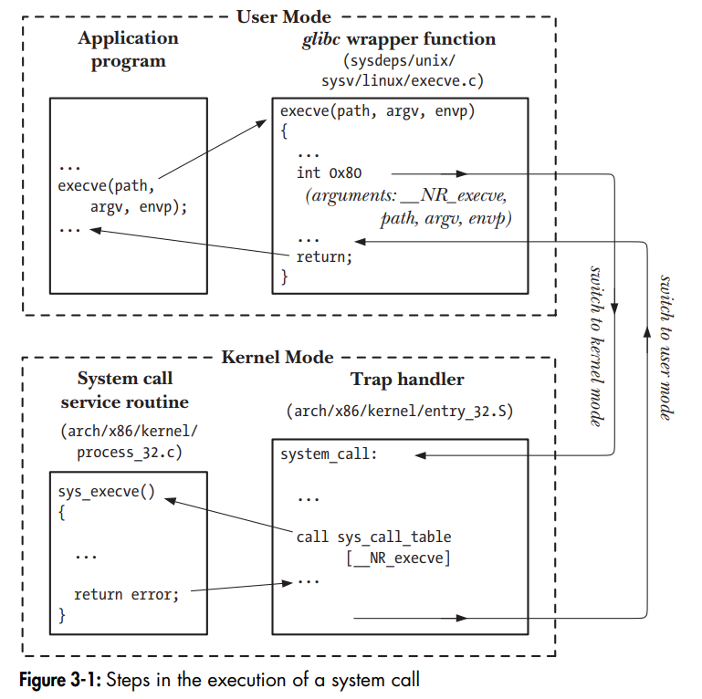
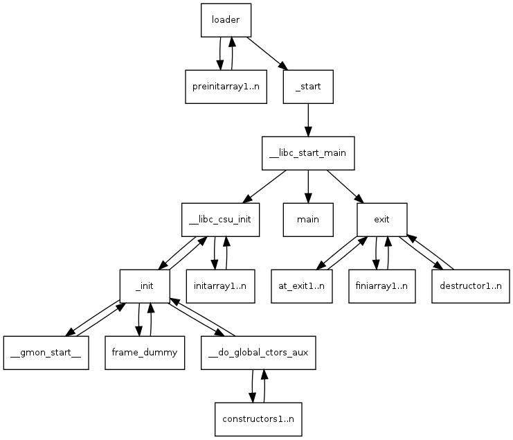

# Lab 1. xv6 compilation and usage

> Author: Andrii Yaroshevych
> 
> Variant: None

## Description
This lab features the compilation, modification and usage of the xv6 operating system. 
The main goal of this lab is to get familiar with the operating systems and their structure.

Besides, this lab includes the implementation of custom system calls, 
environment variables support including PATH and some shell improvements.

## Compilation and running

### Requirements

- [GCC](https://gcc.gnu.org/) compiler
- [QEMU](https://www.qemu.org/) emulator (including qemu-system-i386)
- [GNU Make](https://www.gnu.org/software/make/) build system

> **Note**
>
> You may need to install some additional packages or modify build settings depending on your OS and hardware.
> 
> On non-ELF systems, you will need to install the cross-compiler toolchain to produce x86 ELF binaries or
> use x86 Linux virtual machine to build the project. Remember to modify the `Makefile` accordingly.

### Compilation

> **Note**
> 
> This repository contains fixes for GCC compilers newer than `12.0.0`. It is tested on the following configurations:
> * GCC `10.5.0`, `11.4.0`, `12.3.0`, `13.2.1`
> 
> * QEMU `8.0.4`, `8.1.0`
> 
> and Ubuntu 22.04 LTS (GCC `11.4.0`, QEMU `6.2.0`).
> 
> If you are working on a similar configuration, most likely no additional actions will be required.


To build the xv6 operating system, you need to run the following command:
```bash
make
```

### Running

In order to run the operating system, do the following:
```bash
make qemu
```

or run without `X` environment:
```bash
make qemu-nox
```

> **Note**
> 
> For debugging purposes, see `qemu-gdb` and `qemu-nox-gdb` rules in the `Makefile`.

## Usage and features
The xv6 operating system is a simple UNIX-like operating system and is very similar in usage to it's UNIX counterparts.
It features a simple shell, which is used to run programs and interact with the operating system. Let's walk through
the basic usage of the programs, commands and shell I've implemented.

1. Hello world program
```bash 
xv6> hello
```

This is the simplest program which prints "Hello world!" to the console.

2. `cp`

This program copies the contents of one file to another. It takes two arguments: the source file and the destination file.
```bash
xv6> cp file1 file2
```

It works by iteratively reading the source file into a buffer and writing it to the destination file.

3. `mv`

Moves the file from one location to another. It takes two arguments: the source file and the destination file.
```bash
xv6> mv file1 file2
```

`mv` is a little bit more interesting, but much simpler than the `cp` program. It works just by creating a hard link
to the source file in the destination path and then removing the source file.

4. `testenv`

```bash
xv6> testenv
```

This program was created for testing and demonstrating purposes. It prints all the environment variables of
the current process to the console by reading the `environ` array. For more information about implementation
of environment variables, see the [Additional tasks implemented](#additional-tasks-implemented) section.

5. `export` and `unset`

```bash
xv6> export VAR=value # Sets the environment variable VAR to value
or
xv6> export # Prints all the environment variables
```
```bash
xv6> unset VAR
```

`export` and `unset` are built-in shell commands which allow you to set and unset environment variables. 
Works by modifying the `environ` array of the current process by calling the `setenv()` and `unsetenv()` ulib functions
accordingly.

6. Variable expansion

```bash
xv6> <command> $VAR
```

My implementation of the shell supports variable expansion. It works by replacing all the occurrences of the variable
with it's value in the command line. Uses the `getenv()` ulib function to get the value of the variable.

For example, you can try:
```bash
xv6> export GREP_PATTERN=Copyright
xv6> cat README | grep $GREP_PATTERN
```

7. `PATH` environment variable

```bash
xv6> export PATH=/
```

This is a special environment variable which is used to specify the directories in which the shell will search for
the executable files. It is used by the `execvpe()` function. It's explained in more detail in the 
[Additional tasks implemented](#additional-tasks-implemented) section.

## Additional tasks implemented
- [x] PATH environment variable support

In this section, I want to dive deeper into the implementation of the environment support and the `PATH` variable.

### Possible approaches

The original xv6 operating system does not support environment variables. It simply does not have any API for
setting, getting, modifying or passing environment variables to the processes. I had to come up with a way to
implement this functionality.

The possible approaches to this problem are:
1. Simply creating some global PATH variable and using it in the `exec()` function to search for the executable files.

This approach is very simple and straightforward, but it has a lot of drawbacks. First of all, it is not very flexible.
There is no way to modify the PATH variable for a specific process. Besides, it is not very convenient to use, because
there is no 'canonical' way for user to modify the PATH variable. It indeed could be done by implementing auxiliary
system calls and corresponding user programs like `setpath` and `getpath`, but there is still no way to pass the
PATH variable to user programs and allow them to modify and use it in their own way.

2. Adding a new entry to the process structure which will contain the pointer to the environment variables array.

Although it seems like a slightly better approach, it's not. Now we can modify the environment
variables for a specific process, but there is still no way to pass the environment variables to the user programs.
However, we must store additional information in the process structure, which breaks the OS structure.

Moreover, these approaches do not implement environment variables support as such. They only allow us to modify
the PATH variable, which is, well, not very useful and interesting.

I wanted to fully implement the environment variables support, so I had to come up with a better solution.

### My implementation

The 'right' way of passing environment variables to the processes is `execve()` system call. It takes three arguments:
the path to the executable file, the array of arguments and the array of environment variables. 

```c
int execve(const char *path, char *const argv[], char *const envp[]);
```

Here's how it's executed on the UNIX systems:



My implementation works very similarly. I had to add the `execve()` system call as a replacement for existing `exec()` To do this, I had to modify the
`syscall.c` file, which contains the array of function pointers to the system calls:

```c
static int (*syscalls[])(void) = {
        ...
        [SYS_execve]    sys_execve,
        ...
}
```

Also we should add the function prototype to this file, as we are going to implement it in the `sysfile.c` file:

```c
extern int sys_execve(void);
```

To properly index the system calls array, we should also add the `SYS_execve` constant to the `syscall.h` file:

```c
#define SYS_execve  7
```

`sys_execve()`, in turn, reads the arguments using `fetchint()` and `fetchstr()` functions and calls the `exec()` function, which is responsible
for loading the executable file into the memory and executing it:

```c
int
sys_execve(void)
{
  char *path, *argv[MAXARG], *envp[MAXENV];
  
// read the arguments

  return exec(path, argv, envp);
}
```

For user programs to be able to use the `execve()` system call, we should add the proper interface to the `usys.S` file:

```asm
...
SYSCALL(execve)
...
```

and add the user function prototype to the `user.h` file:

```c
...
int execve(const char*, char* const*, char* const*);
```

Continuing with `envp`, it is often passed as a third argument to the program's `main()` function:

```c
int main(int argc, char *argv[], char *envp[]);
```

It's achieved by placing the pointer to the environment variables array on stack which looks like this depending on the
system's ABI, but let's use the System V ABI:

```text
   * sp     :    argc
   * argv   :    argv[0]
   *             argv[1]
   *             ...
   *             NULL
   * envp   :    envp[0]
   *             envp[1]
   *             ...
   *             NULL
```

Let's take a closer look at the `exec()` function to understand how my modification works:

```c
  ...
  for (envc = 0; envp[envc]; envc++) {
    if (envc >= MAXENV)
      goto bad;
    sp = (sp - (strlen(envp[envc]) + 1)) & ~3;
    if(copyout(pgdir, sp, envp[envc], strlen(envp[envc]) + 1) < 0)
      goto bad;
    ustack[argc + 2 + envc] = sp;
  }
  ustack[argc + 2 + envc] = 0;
  ...
```

This modified version of the `exec()` function iterates over the `envp` array and copies the pointers to the environment
variables to the stack. 

Now `envp` pointer is now should be accessible from the user program. Well, almost. There is still one major problem.
The xv6 operating system lacks the C runtime, especially `crt0`. `crt0` is basically the set of startup routines
linked into C program that performs initialization tasks before calling the main function. Indeed, let's take a look
on how the `main()` function is called on the UNIX systems:



As wee see, the entrypoint of the program is not the `main()` function, but the `_start()` function, which calls
`__libc_start_main()` function, which, in turn, calls the `main()` function. 

We need these functions to properly initialize the environment and call the `main()` function with the correct arguments.
And indeed, if we take a look on what POSIX says about environment variables, there is one more problem that we aim to solve. 
It says that the use of a third argument to the main function is not specified in POSIX. According to POSIX, the
environment should be accessed via the external variable `environ`. Setting this variable to point to the environment
is the responsibility of the `__libc_start_main()` function.

Let's take a look on my implementation of the `crt0`:

```asm
.text
.globl _start

_start:
    xorl %ebp, %ebp

	popl %esi
	movl %esp, %ecx

	// We don't need to align the stack to 16 bytes,
	// since SSE is disabled by -mgeneral-regs-only.
	pushl %ecx
	pushl %esi

	pushl $main

	call __libc_start_main
    call exit
```

The `xorl %ebp, %ebp` instruction is used to set the `ebp` register to zero. It is used to mark the end of the stack frame.
This is the ABI suggestion and not our point of interest.

`popl %esi` instruction is used to pop the first argument `argc` from the stack to the `esi` register. Now `esp` points
to the `argv` array. We need to save the `esp` value to the `ecx` register, because we will need it later.
Now, what we _should have done_ is to align the stack to 16 bytes, which is required by the SSE (Streaming SIMD Extensions)
for memory and cache efficiency. However, here we can drop it for simplicity, especially because we disabled SSE by using the `-mgeneral-regs-only`

Now we should prepare the stack for the `__libc_start_main()` function:
```c
int __libc_start_main(int (*) (int, char**, char**), int, char**);
```

The first argument is the `main()` function, the second argument is the `argc` and the third argument is the `argv` array.
We push these to the stack and call the `__libc_start_main()` function:

```asm
pushl %ecx  // argv
pushl %esi  // argc
pushl $main // main
call __libc_start_main
```

Now, let's take a look on the `ulibc_start.c` file, which contains the implementation of the `__libc_start_main()` function
and declares the `environ` variable:

```c
char **environ;

int __libc_start_main(int (*main) (int, char**, char**), int argc, char** argv) {
  environ = &argv[argc + 1];

  return main(argc, argv, environ);
}
```

As we see, it takes care of setting the `environ` variable to point to the environment variables array. Its address
is calculated by adding the `argc` to the `argv` array pointer and then adding one to the result (to skip the `NULL` terminator of the `argv` array).
It then just calls the `main()` function with the correct arguments.

As you may have noticed, there is one more function call in the `_start` function: `exit()`. It is used to terminate
the process after the `main()` function returns, and that's why we had to manually call `exit()` in the user programs.
Now we can just return from the `main()` function and `crt0` will take care of the rest. By the way, this also eliminates
the need of pushing this weird fake return address to the stack: `ustack[0] = 0xfffffff` which is used in the original
implementation of the `exec()` function for xv6.

Now we need to tell the linker we want to use `_start` as the entrypoint of
programs. Let's take a look on the `Makefile`, namely the rule for building the user programs (starting with `_`):

```makefile
ULIB = ulib.o usys.o printf.o umalloc.o

_%: %.o $(ULIB)
	objcopy --remove-section .note.gnu.property ulib.o
	$(LD) $(LDFLAGS) -N -e main -Ttext 0 -o $@ $^
	$(OBJDUMP) -S $@ > $*.asm
	$(OBJDUMP) -t $@ | sed '1,/SYMBOL TABLE/d; s/ .* / /; /^$$/d' > $*.sym
```

The `-e main` option tells the linker to use `main` as the entrypoint of the program. We need to change it to `_start`:

```makefile
$(LD) $(LDFLAGS) -N -e _start -Ttext 0 -o $@ $^
```

and link the programs against the `ulibc_start.o` along with `crt0.o`:

```makefile
ULIB = ulib.o usys.o printf.o umalloc.o ulibc_start.o crt0.o
```

However, there is still one more step to take. We need to provide the API for setting, getting and modifying
the environment variables. I've implemented the following functions in the `ulib.c` file:

```c
int setenv(const char *name, const char *value, int overwrite);
int unsetenv(const char *name);
char *getenv(const char *name);
```

They are very similar to the POSIX functions with the same names. 

Now that's it! We have implemented the environment variables support in the xv6 operating system, and we can finally
continue with the `PATH` variable.

The `PATH` variable, as stated above, is special. It is used by the `execvpe()`, which in contrast to `execve()`
takes care of searching for the executable file in the directories specified by the `PATH` variable. Its implementation
is pretty straightforward, however contains a lot of parsing and string manipulation, so let's only take a glance at
the most important parts:

```c
int execvpe(const char *file, char *const argv[], char *const envp[]) {
  if (strchr(file, '/') != 0) {
    return execve(file, argv, envp);
  }

  char *path = getenv("PATH");
  ...
  
  // Search for delimiter

  while (token != 0) {
    ...

    int exec_result = execve(full_path, argv, envp); // Try executing
    if (exec_result == 0) {
      return exec_result; // Return if succeeded
    }
    ...
    // Move on to the next entry
  }
  return -1;
}
```

As we see, it first checks if the `file` argument contains the `/` character. If it does, it means that the user
specified the full path to the executable file, so we can just call the `execve()` function. Otherwise, we should
search for the executable file in the directories specified by the `PATH` variable. It is done by iterating over
the `PATH` variable and trying to execute the file in the current directory. If it succeeds, we return the result
of the `execve()` function. Otherwise, we move on to the next entry in the `PATH` variable. 

Note that `execvpe()` is a libc function, rather than a system call, used as a wrapper for the `execve()` system call.

Now we can finally use the `PATH` variable. As I've said before, there are `export` and `unset` built-in commands
which allow us to set and unset the environment variables directly from the shell. 

Feel free to try it!

## License
The [MIT](https://choosealicense.com/licenses/mit/) License (MIT)

Copyright © 2023. Andrii Yaroshevych.
